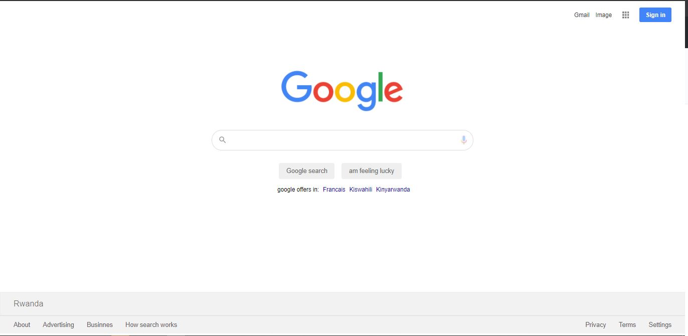

# html-css-project
> Badges : // html-css-project

## Project vision
> Vision : // the vision is to consatrate and and learn html- css  from zero to hero

## Project description
> Description : //this google home pages is a one page but builded into three part
- Header of the page
- Body of the page
- Footer of the page

## Screenshot (s)
> Screenshots: // The following screenshots, shows the cloning of google home page)

## Built with
> Built with : 
* this home page is designed in with Html and Css
## Features
> Features : // List of features, what a user will be able to do with this project. Eg: a user can signup

## Deployments
	* Live demo link //The link of deplyoment of your project
	* Documentation link //Link to documentation of this project

## Tools
> Tools : //List of all tools you used building this projects. Example: Code editor, CI/CD tools, Testing tools, deplyoment tools, ...
```bash

- vscode

```

### Prerequisites
> What should I have already to run this project locally?
```bash
1. clone the app 
2. run it in compiler
```
### Tests
> How to run tests locally?
```bash
1. you can run it on your local computer by any code compiler
```

## Author (s)
### 1. Kalisa Jonathan
* Github: [@jonathan1965](https://github.com/jonathan1965)
* Twitter: [@JonathanKalisa](https://twitter.com/JonathanKalisa)
* LinkedIn: [Jonathan Kalisa](https://www.linkedin.com/in/jonathan-kalisa-22756b195/)


===> You can find this readme file template [on this link](https://github.com/nezago/nezago-guidelines/wiki/Readme-file-template)